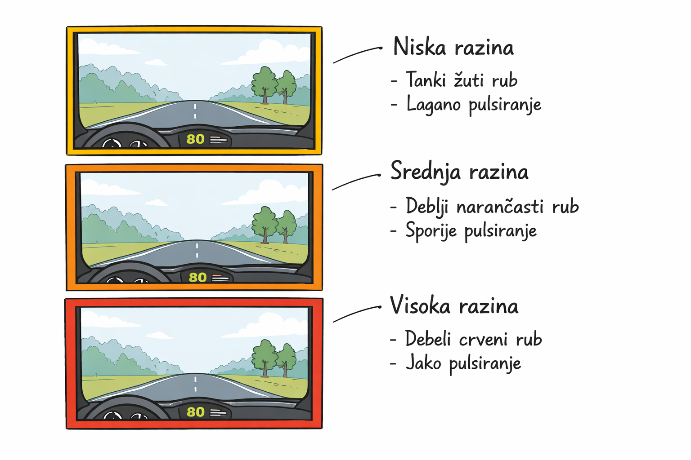
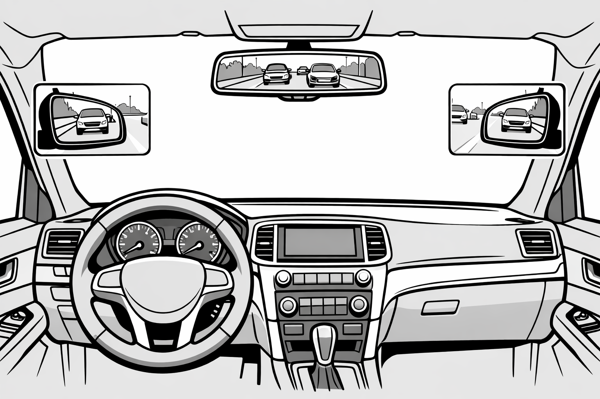
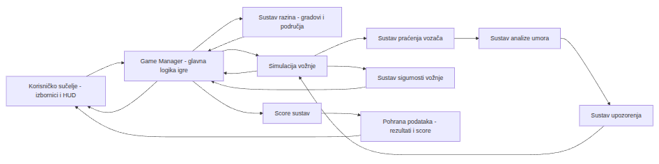

# Dokument dizajna igre

## Podaci o projektu
- Naziv igre: Focus Drive
- Autori: Lana Kohut, Daniel Katić i Luka Batarelo
- Verzija dokumenta: 1.0
- Datum: 06.02.2026.

---

## 1. Uvod

### 1.1 Svrha dokumenta
Ovaj dokument definira dizajn i funkcionalne specifikacije simulatora vožnje namijenjenog istraživanju ljudskog umora tijekom vožnje. Služi kao vodilja developerima za implementaciju igre i timu istraživača za razumijevanje na koji način se analiziraju i prikupljaju podaci.

### 1.2 Povezanost s istraživačkim projektom
Igra je ključni alat projekta DMM (Driver Monitoring Model). Ona stvara kontrolirano, repetitivno okruženje potrebno za poticanje stanja smanjene budnosti kod ispitanika. Važno je naglasiti da je AI sustav koji analizira te podatke odvojen istraživački entitet, dok igra služi isključivo kao platforma za generiranje scenarija i prikupljanje parametara kroz igru.

### 1.3 Opseg dokumenta
Dokument obuhvaća dizajn okruženja (autoceste, noć), scenarije kroz igru, općenite opise uloge i zadatka igrača, integraciju AI modula, sustav povratnih informacija tj. upozorenja te tehničke zahtjeve i okvirne specifikacije.

---

## 2. Vizija igre

### 2.1 Opis vizije
Igra je napredni simulator sigurnosti koji simulira najopasnije aspekte dugotrajne vožnje: monotoniju i smanjenu vidljivost u teškim uvjetima. Igrač se bori s "hipnozom ceste" dok integrirani AI sustav u pozadini neprestano analizira njegovo stanje. Vizija je stvoriti simbiozu između čovjeka i stroja gdje igra reagira na biološke signale umora (npr. ako igrač predugo ne trepne ili mu glava klone, igra aktivira specifične podražaje tj. upozorenja).

### 2.2 Game logline
Inteligentni simulator vožnje koji koristi AI kako bi prepoznao i reagirao na tvoj umor u najtežim uvjetima ceste.

### 2.3 Jedinstvenost igre
Igra se ne oslanja samo na pritisak tipki, već na stvarno fiziološko stanje igrača. AI sustav prepoznaje umor prije nego što igrač napravi grešku na cesti, pretvarajući "pasivni" simulator u "aktivni" sustav zaštite.

### 2.4 Look and feel
Vizualni dojam teži čim vjernijim prikazima stvarnih uvjeta (kiša, magla, noć) koji otežavaju vožnju. Atmosfera treba uglavnom biti umirujuća, ali opasno monotona te na taj način uz vizualno teške uvjete potencirati umor vozača.

---

## 3. Ciljana publika i platforme

### 3.1 Ciljana publika
Studenti, znanstveni djelatnici, osoblje u autoškolama te svi koji vole voziti.

### 3.2 Platforme
Osobno računalo - zbog procesorske snage potrebne za istovremeno izvođenje igre i AI modela za analizu slike u stvarnom vremenu.

### 3.3 Hardverski zahtjevi
Okvirni zahtjevi:
- minimalni: CPU s 6 jezgri (zbog AI paralelizacije), 16GB RAM, HD Web kamera (30 FPS)

---

## 4. Opći opis igre

### 4.1 Žanr igre
Žanr igre je simulacija, odnosno, ozbiljna igra.

### 4.2 Način igranja
Vožnja kroz igru na računalu s naglaskom na budnost i izdržljivost u vožnji. AI sustav djeluje kao "suvozač" koji nadzire igrača.

### 4.3 Ciljevi igrača
Prevesti zadanu dionicu bez aktivacije AI alarma visoke razine, održavajući budnost uz dosadnu vožnju kroz teške ili dosadne uvjete na cesti.

---

## 5. Taktički aspekti igre (Gameplay)

### 5.1 Osnovna mehanika igre
Neovisno o odabranoj metodi upravljanja igrom, igra dozvoljava kontrolu kretanja naprijed, nazad, lijevo, desno te također omogućava detaljniju kontrolu vožnje:
- Kontrola kvačila/spojke
- Mijenjanje brzine
- Automatski/ručni pokazivač smjera
- Paljenje/gašenje prednjih i zadnjih svjetala
- Zoomirani pogled u retrovizore
- Kočenje
Ovo su osnove mehanike vožnje potrebne za simulaciju same vožnje u igri. 

### 5.2 Upravljanje i kontrole
Tipkovnica:
  
| Tipka | Akcija                                      |
|-------|---------------------------------------------|
| ⬆/W   | Vožnja naprijed                             |
| ⬇/S   | Kočenje/Vožnja unazad                       |
| ➡/D   | Skretanje desno                             |
| ⬅/A   | Skretanje lijevo                            |
| 1     | Prva brzina                                 |
| 2     | Druga brzina                                |
| 3     | Treća brzina                                |
| 4     | Četvrta brzina                              |
| 5     | Peta brzina                                 |
| 6     | Šesta brzina                                |
| 7/Q   | Pokazivač smjera ulijevo                    |
| 8/E   | Pokazivač smjera udesno                     |
| 9/F   | Paljenje/gašenje prednjih svijetala         |
| 0/B   | Paljenje/gašenje stražnjih svijetala        |
| M     | Zoomirani pogled u sve retrovizore          |
| Shift | Kvačilo                                     |

Kontroler:

| Tipka | Akcija                                      |
|-------|---------------------------------------------|
| L2    | Vožnja naprijed/unazad/kočenje              |
| L1    | Skretanje desno/lijevo                      |
| RT    | Mijenjanje brzine prema gore (ubrzavanje)   |
| LT    | Mijenjanje brzine prema dolje (usporavanje) |
| ⬅     | Pokazivač smjera ulijevo                    |
| ➡     | Pokazivač smjera udesno                     |
| ⬆     | Paljenje/gašenje prednjih svijetala          |
| ⬇     | Paljenje/gašenje stražnjih svijetala         |
| +     | Zoomirani pogled u sve retrovizore          |
| X/🔺  | Kvačilo                                     |

Volan i pedale (opcionalno)

| Tipka                  | Akcija                                      |
|------------------------|---------------------------------------------|
| Pedala lijevo          | Kvačilo                                     |
| Pedala sredina         | Kočenje                                     |
| Pedala desno           | Gas                                         |
| Y/🔺                   | Vožnja naprijed                             |
| A/X                    | Vožnja unazad                               |
| Okretanje volana desno/lijevo | Skretanje desno/lijevo          |
| RB                     | Mijenjanje brzine prema gore (ubrzavanje)   |
| LB                     | Mijenjanje brzine prema dolje (usporavanje) |
| ⬅                      | Pokazivač smjera ulijevo                    |
| ➡                      | Pokazivač smjera udesno                     |
| ⬆                      | Paljenje/gašenje prednjih svijetala          |
| ⬇                      | Paljenje/gašenje stražnjih svijetala         |
| +                      | Zoomirani pogled u sve retrovizore          |

### 5.3 Sustav umora
Umor se simulira pomoću:
- Prilikom svakog distrakcijskog događaja, igrač dobiva opciju da u kratkom roku odgovori na pitanje gdje želi usmjeriti svoju pažnju.
- Ako ne odgovori na pitanje na vrijeme, automatski se računa kao da je kliknuo da želi usmjeriti pažnju na distrakcijski događaj te se povećava mjerač umora.

### 5.4 Distrakcijski događaji
- reklame uz autocestu (neanimirane i animirane) - lako oduzimaju pažnju
- zvonjava vozačevog mobitela u autu
- kamion sa glasnom reklamom koji prolazi pored nas ili u suprotnom smjeru
- žongleri na pješačkom
- GPS krivo postavljen, daje krive upute
- protest/parada u gradu
- prolivena kava po autu i vozaču
- puno obavijesti u kratkom vremenu na mobitelu (mobitel vibrira, blješti ili zvoni)
- tjelesne distrakcije: svrbež na nekom dijelu tijela, bolovi, ukočenost vrata/ramena/leđa

### 5.5 Pravila igre
- Nije dopušteno ilegalno kretanje sa automobilom (kretanje travom, preko ograde uz cestu, po dvorištima, po kolniku), igra daje upozorenje te vraća igrača na točku prije ilegalnog skretanja
- Dopušteno je praćenje pravila prometa u stvarnom svijetu te vožnja u igri u skladu s time
- Kampanje: Igrač u svakoj kampanji ima zadatak doći od točke A do točke B bez okidanja upozorenja za umor (ili može imati dopuštena 3 upozorenja (nisko, srednje, visoko) prije nego što ga igra vrati na početak kampanje)
- Sandbox: Igrač vozi gdje god želi, ali sa istim ograničenjem umora kao i u kampanji. Razlika ovdje bi bila što igrač nakon 3 upozorenja može birati gdje će se pojaviti (spawn point)

---

## 6. Scenariji igranja

### 6.1 Scenarij: monotona vožnja
Duga vožnja autocestom (20-30 minuta real-time) sa malo vizualnih promjena uz cestu.

### 6.2 Scenarij: noćna vožnja
Vožnja slabije osvjetljenim gradom ili mjestom sa više slabije vidljivih skretanja, kružnih tokova, pješačkih prijelaza.

### 6.3 Scenarij: gradska vožnja
Vožnja sa više mogućih distrakcijskih događaja uključenih (npr žongleri, protest, prolivena kava,...)

---

## 7. Sustav praćenja korisnika

### 7.1 Uloga kamere
Kamera ne služi samo snimanju već i kao izvor podataka za AI sustav. Ona u realnom vremenu snima te se svakih npr. 50 milisekundi snimi slika za AI model koji izračunava postotak zatvorenosti očiju i frekvenciju treptanja.

### 7.2 Podaci koje igra prikuplja
Biometrija: AI detektira mikrosan tj. gledanje u prazno, zijevanje i nagib glave
Telemetrija: Odstupanje od trake (Lane Departure) sinkronizirano s detekcijom pogleda

### 7.3 Granice sustava
Kad AI prepozna kritičnu razinu umora, igra aktivira:
- vizualna upozorenja
- glasovna upozorenja

---

## 8. Sustav upozorenja

Sustav upozorenja ima cilj pravovremeno obavještavati korisnika o smanjenoj razini koncentracije ili pojavi umora tijekom igranja.

Njegova je uloga povećati sigurnost i svijest korisnika, bez narušavanja korisničkog iskustva.

Upozorenja su dizajnirana tako da budu jasno uočljiva, ali nenametljiva, te prilagodljiva različitim situacijama.

Sustav podržava više vrsta upozorenja kako bi se osigurala učinkovita komunikacija s korisnikom.

Zbog ograničenja prikaza na zaslonu, sustav upozorenja koristi kombinaciju simulacije realnih automobilskih indikatora i vizualnih pojačanja preko ekrana kako bi se postigla veća uočljivost i razumijevanje upozorenja.

### 8.1 Vrste upozorenja

#### 8.1.1 Vizualna upozorenja

Vizualna upozorenja prikazuju se na ekranu u obliku jasno prepoznatljivih grafičkih elemenata i promjena u korisničkom sučelju. Njihova je svrha diskretno, ali učinkovito skrenuti pažnju korisniku bez korištenja zvuka. Ova vrsta upozorenja posebno je korisna u situacijama gdje zvuk nije poželjan ili treba biti ograničen, ali se može koristiti i u kombinaciji s drugim vrstama upozorenja.

Vizualna upozorenja uključuju i simulaciju upozoravajuće lampice, nalik
onima koje se koriste u stvarnim vozilima (npr. simbol umora ili pažnje),
koja je stalno vidljiva na HUD-u. Ova lampica služi kao primarni,
realistični indikator upozorenja, dok se dodatni vizualni efekti koriste
za pojačavanje uočljivosti na zaslonu.

Primjeri vizualnih upozorenja u igri uključuju:
- promjenu boje rubova ekrana (npr. postupno crvenilo ili zatamnjenje)
- pojavu ikone upozorenja na HUD-u (npr. simbol oka ili umora)
- kratku tekstualnu poruku ili obavijest na ekranu
- blago zamućenje slike ili smanjenje kontrasta kako bi se simulirao pad koncentracije
- treperenje ili pulsiranje određenih elemenata korisničkog sučelja
- aktivaciju upozoravajuće lampice na HUD-u (simulacija upozorenja u vozilu)
- blago obojani overlay preko cijelog ekrana koji označava stanje upozorenja

*Vizualno upozorenje prikazano promjenom boje rubova ekrana, pri čemu boja i debljina ruba označavaju razinu upozorenja.*

*Upozorenje prikazano overlayom gdje se mijenja boja cijelog ekrana, te se kombinira s simbolom i tekstom.*

#### 8.1.2 Zvučna upozorenja

Zvučna upozorenja koriste kratke zvučne signale ili tonove kako bi brzo privukla pažnju korisnika. Ova vrsta upozorenja osobito je korisna u situacijama kada vizualni elementi mogu proći nezapaženo, primjerice kada je korisnik fokusiran na središnji dio ekrana ili ne primjećuje promjene u sučelju.

Zvučna upozorenja u igri mogu uključivati:
- kratki upozoravajući zvučni signal
- ton sličan alarmu ili obavijesti u vozilu
- suptilan, ali ponavljajući zvuk koji signalizira smanjenje koncentracije

Zvučni signali dizajnirani su tako da ne budu agresivni, već informativni, te da ne narušavaju ukupni doživljaj igre.

#### 8.1.3 Kombinirana upozorenja

Kombinirana upozorenja predstavljaju istovremenu primjenu više vizualnih elemenata, poput upozoravajuće lampice na HUD-u i blago obojenog overlaya
preko cijelog ekrana, uz mogućnost korištenja zvučnih signala.

Ovakav pristup koristi se u kritičnim situacijama kada je potrebno nadoknaditi ograničenja prikaza na ekranu i osigurati maksimalnu uočljivost upozorenja.

### 8.2 Razine upozorenja

Sustav upozorenja podijeljen je u više razina, ovisno o stupnju smanjenja koncentracije ili razini umora detektirane tijekom igranja. Razine upozorenja omogućuju postupno i prilagodljivo reagiranje sustava, čime se izbjegava naglo ili nepotrebno ometanje korisnika, dok se u kritičnim situacijama osigurava brza i jasna reakcija.

#### 8.2.1 Niska razina upozorenja

Niska razina upozorenja aktivira se pri blagom padu koncentracije. Cilj ove razine je diskretno upozoriti korisnika bez značajnijeg prekidanja tijeka igre.

U ovoj razini koriste se prvenstveno suptilna vizualna upozorenja, poput blage promjene boje korisničkog sučelja, pojave male ikone upozorenja na HUD-u ili kratke nenametljive poruke. Zvučna upozorenja u ovoj fazi uglavnom se ne koriste ili su vrlo blaga, ovisno o postavkama igre.

#### 8.2.2 Srednja razina upozorenja

Srednja razina upozorenja aktivira se kada sustav detektira kontinuirani ili izraženiji pad koncentracije. Ova razina ima za cilj jasno skrenuti pažnju korisniku i potaknuti ga na svjesniju reakciju.

U ovoj fazi koriste se izraženija vizualna upozorenja, poput pulsiranja rubova ekrana, vidljivijih HUD indikatora ili kratkih tekstualnih obavijesti. Po potrebi se uvode i zvučni signali umjerenog intenziteta, čime se povećava uočljivost upozorenja bez narušavanja doživljaja igre.

#### 8.2.3 Visoka (kritična) razina upozorenja

Visoka razina upozorenja aktivira se u situacijama kada je detektirana značajna razina umora ili ozbiljan pad koncentracije koji može negativno utjecati na uspješnost ili sigurnost korisnika.

Ova razina koristi kombinirana upozorenja koja uključuju stalno aktivnu upozoravajuću lampicu na HUD-u, izražen vizualni okvir ili blago obojani overlay preko cijelog ekrana, kao i zvučne signale visoke uočljivosti.

Cilj ove razine je nadomjestiti nemogućnost potpunog prikaza realnog
upozorenja iz stvarnog vozila te osigurati da korisnik jasno i
nedvosmisleno percipira stanje povećanog rizika.

### 8.3 Reakcija sustava na upozorenja

Reakcija sustava na upozorenja ovisi o aktivnoj razini upozorenja te je dizajnirana tako da postupno utječe na tijek igre, bez naglog prekida korisničkog iskustva. Sustav reagira dinamički, prilagođavajući se stanju korisnika i kontekstu igre.

Kod niske razine upozorenja, sustav ne mijenja mehanike igre, već korisniku pruža isključivo informativni signal. Igra se nastavlja neometano, a upozorenje služi kao blagi podsjetnik na smanjenje koncentracije.

Kod srednje razine upozorenja, sustav može dodatno naglasiti upozorenje te potaknuti korisnika na svjesniju reakciju. U ovoj fazi moguće je privremeno pojačavanje vizualnih ili zvučnih indikatora, kao i prikaz savjeta ili kratke poruke koja korisnika upozorava na potrebu za povećanom pažnjom ili kratkim odmorom.

Kod visoke (kritične) razine upozorenja, sustav može aktivno intervenirati u tijek igre. To može uključivati ali i ne mora automatsko pauziranje igre, jasno istaknutu poruku upozorenja ili preporuku za prekid igre. Cilj ove reakcije nije kažnjavanje korisnika, već zaštita korisničkog iskustva i simulacija realnih posljedica smanjene koncentracije.

Nakon reakcije sustava, korisniku se omogućuje nastavak igranja, prilagodba postavki upozorenja ili prekid igre, ovisno o vlastitoj procjeni i preporukama sustava.

### 8.4 Prilagodba sustava upozorenja korisniku

Sustav upozorenja omogućuje prilagodbu prema preferencijama korisnika kako bi se osiguralo optimalno korisničko iskustvo bez nepotrebnog ometanja. Cilj prilagodbe je omogućiti korisniku kontrolu nad načinom i intenzitetom upozorenja, uz zadržavanje osnovne funkcionalnosti sustava.

Korisnik može prilagoditi vrstu upozorenja koje želi primati, uključujući mogućnost uključivanja ili isključivanja vizualnih i zvučnih upozorenja. Također je moguće prilagoditi intenzitet zvučnih signala, učestalost pojavljivanja upozorenja te razinu njihove izraženosti unutar korisničkog sučelja.

Sustav omogućuje i prilagodbu osjetljivosti upozorenja, čime korisnik može utjecati na pragove pri kojima se pojedine razine upozorenja aktiviraju. Na taj način sustav se može prilagoditi različitim stilovima igranja i individualnim razlikama među korisnicima.

Sve prilagodbe dostupne su kroz izbornik postavki igre te se primjenjuju u stvarnom vremenu, bez potrebe za ponovnim pokretanjem igre. Time se osigurava fleksibilnost sustava uz zadržavanje jasnoće i konzistentnosti upozorenja tijekom igranja.

---

## 9. Korisničko sučelje (UI)

### 9.1 Pregled sučelja
Glavni ekran uključuje pozadinu, naziv igre te meni:
- Nova igra (New Game) -> Kampanja (Campaign)/Slobodno igranje (Free Play/Sandbox)
- Učitaj igru (Load Game)->Odaberi slot za učitavanje igre (Choose a slot to start playing the game)
- Postavke (Settings)->Grafika (Graphics), Audio, Kontrole (Controls), Jezik (Language)
- Izlaz (Exit)

### 9.2 HUD elementi
Na zaslonu je vidljivo prednje staklo auta sa brisačima, volan, brzinomjer, ventilatori, radio, ladica na suvozačevoj strani.
Mjenjač se pojavljuje preko radia pritiskom gumba za kvačilo+brzinu te se prikazuje ruka na mjenjaču koja povećava ili smanjuje brzinu.
Pritiskom gumba za retrovizore se prikazuju zoomirani retrovizori blizu ili na mjestima gdje se inače nalaze.
U donjem desnom kutu je vidljiv mjerač umora koji mjeri vozačev umor te se u odnosu na njega prikazuju ili ne prikazuju upozorenja.

### 9.3 Wireframe prikazi

---

## 10. Dijagrami

### 10.1 Dijagram toka igre

Dijagram toka prikazuje cjelokupni tijek igre, počevši od glavnog izbornika, odabira razine i pokretanja simulacije vožnje. 

Tijekom vožnje paralelno se prati stanje vozača, sigurnost vožnje i bodovanje, pri čemu nijedan od tih sustava ne ovisi izravno o ostalima. 

Sustav umora generira upozorenja različitih razina, dok sustav sigurnosti neovisno detektira prometne incidente koji mogu dovesti do završetka razine. 

Nakon završetka vožnje, igraču se prikazuje rezultat razine te se omogućuje povratak u izbornik razina ili pregled ostvarenih rezultata.

### 10.2 Arhitektura sustava

Blok-dijagram sustava prikazuje glavne funkcionalne cjeline igre i
njihove međusobne odnose. 
Game Manager predstavlja središnju komponentu koja upravlja simulacijom vožnje, razinama i komunikacijom izmedu sustava. 
Sustav praćenja vozača i sustav analize umora omogućuju generiranje upozorenja, dok sustav sigurnosti vožnje
neovisno detektira prometne incidente. 
Score sustav prikuplja podatke o uspješnosti vožnje i pohranjuje ih za kasniji pregled kroz korisničko sučelje.

---

## 11. Svijet igre

### 11.1 Okruženja
- 4 različita grada raspoređena po težinama
- Prvi grad ima najlakšu težinu, što znači da ima najmanje događaja koji uzrokuju umor
- Drugi grad ima srednju težinu te se povećava broj događaja koji uzrokuju umor, isto se ponavlja za treći i četvrti grad
- Svaki grad uključuje: promjene iz dana u noć, različite vremenske uvjete, autocestu
- Prvi grad uključuje: noćnu vožnju, smanjeno osvjetljenje u nekim predjelima grada ili okolice grada, kišu (slabu i srednja), srednji vjetar, sunčano vrijeme, oblačno vrijeme, kiša s grmljavinom
- Drugi, treći i/ili četvrti grad uključuju: kompleksnije vremenske uvjete (snijeg, magla, poledica, jaki vjetar, jaka kiša (od koje mogu nastati poplave)), više događaja koji mogu uzrokovati umor, duže noćne vožnje i duže vožnje autocestom

### 11.2 Vremenski uvjeti
Vrijeme bi se mijenjalo u skladu sa godišnjim dobom i umjerenim klimatskim pojasom. 
Igrač bi unutar jednog dana najčešće imao više vremenskih uvjeta, ovisno gdje i koliko daleko vozi. Vrijeme bi se prilagođavalo lokaciji, godišnjem dobu te dobu dana (vizualno bi oblačno vrijeme izgledalo drugačije po noći nego po danu).

---

## 12. Popis medija

### 12.1 Grafički elementi
- Prednja unutrašnjost automobila (iz perspektive vozača)
- 4 različita grada i njihovih okolica sa svim elementima prometa (lokalne ceste, državne ceste, autoceste, drugi automobili, pješaci, prometni znakovi, semafori, pješački prijelazi, škole, autoceste, kružni tokovi,...)
- Različite zgrade (stambene, poslovne, društvene)
- vegetacija uz cestu, parkovi
- tematski parkovi (za pse, skateboard)
- Reklame uz autocestu i uz gradske ceste
- Ruke vozača na volanu
### 12.2 Audio elementi
- zvukovi prometa, pješaka kako razgovaraju (na semaforu) ili puštaju glasnu muziku
- zvuk semafora za pješake
- zvuk igračevog automobila
- zvuk kamiona koji puštaju glasne reklame
### 12.3 Animacije
- Pop-in/pop out animacija prilikom aktiviranja gumba za zoomirana ogledala
- Fade-in animacija za upozorenja
- Eksplozija zvijezdica za uspješno završen grad u svakoj kampanji

---

## 13. Tehničke specifikacije

### 13.1 Razvojno okruženje

Razvoj igre provodi se u **Unity** razvojnome okruženju, koristeći programski jezik **C#**.  
Unity je odabran zbog dobre podrške za razvoj simulacija u stvarnom vremenu, upravljanje scenama, rad s kamerama te jednostavne integracije vanjskih sustava.  
Projekt koristi modularni pristup razvoju, pri čemu su pojedine funkcionalnosti igre (upravljanje razinama, simulacija vožnje, sustav upozorenja i bodovanja) implementirane kao zasebne cjeline.

---

### 13.2 Tehnička ograničenja

Tijekom razvoja igre uzeta su u obzir sljedeća tehnička ograničenja:

- **Performanse sustava**  
  Igra mora raditi u stvarnom vremenu uz kontinuirano praćenje stanja vozača i simulaciju vožnje. Posebnu pažnju posvetiti ćemo optimizaciji kako bi se izbjegli padovi performansi tijekom izvođenja.

- **Korištenje kamere**  
  Sustav praćenja vozača temelji se na podacima dobivenim putem kamere. Kvaliteta i pouzdanost detekcije ovise o dostupnosti kamere, osvjetljenju prostora te poziciji korisnika u odnosu na kameru.

- **Rezolucije i prikaz**  
  Igra je prilagođena radu na različitim rezolucijama zaslona. Korisničko sučelje dizajnirano je responzivno kako bi ostalo čitljivo i funkcionalno na različitim veličinama ekrana.

---

### 13.3 Integracija s vanjskim sustavima

Igra je konceptualno predviđena za integraciju s vanjskim **AI sustavom za analizu umora vozača**, koji se razvija kao zasebna komponenta.  
Unity aplikacija prikuplja potrebne ulazne podatke te ih prosljeđuje AI sustavu na obradu.  
Rezultati analize vraćaju se u igru u obliku apstraktnih informacija o stanju vozača (npr. razina umora), koje se zatim koriste za aktivaciju odgovarajućih upozorenja i utjecaj na tijek igre.  
Detaljna implementacija komunikacije i obrade podataka nije dio ovog projekta te je izvan opsega ove dokumentacije.

---

## 14. Rizici i ograničenja

### 14.1 Tehnički rizici

Razvoj igre uključuje više tehničkih komponenti koje mogu predstavljati potencijalne rizike.  
Najveći tehnički rizik odnosi se na stabilnost i točnost sustava za praćenje stanja vozača, koji ovisi o kvaliteti ulaznih podataka i uvjetima korištenja.  
Postoji i rizik povezan s performansama aplikacije, budući da se istovremeno izvodi simulacija vožnje, analiza podataka i prikaz korisničkog sučelja u stvarnom vremenu.  
Dodatni tehnički izazov predstavlja integracija vanjskog AI sustava, koja zahtijeva usklađivanje formata podataka i vremena odaziva.

---

### 14.2 Hardverska ograničenja

Funkcionalnost igre djelomično ovisi o hardverskim mogućnostima korisničkog sustava.  
Korištenje kamere za praćenje vozača može biti ograničeno kvalitetom kamere, osvjetljenjem prostora te položajem korisnika u odnosu na kameru.  
Različite konfiguracije računala i razine grafičkih performansi mogu utjecati na stabilnost i fluidnost izvođenja simulacije.  
Zbog toga je potrebno prilagoditi postavke igre kako bi se osigurao prihvatljiv rad na širem rasponu uređaja.

---

### 14.3 Organizacijski rizici

Projekt se razvija timski, što sa sobom nosi određene organizacijske rizike.  
Razdvajanje razvoja igre i AI sustava između različitih timova može dovesti do problema u koordinaciji, komunikaciji i usklađivanju rokova.  
Postoji i rizik vezan uz raspoloživo vrijeme članova tima, budući da se projekt razvija paralelno s ostalim akademskim obvezama.  
Kako bi se smanjili organizacijski rizici, važno je jasno definirati odgovornosti, komunikacijske kanale i vremenske okvire rada.

---

## 15. Zaključak

Ovim dokumentom dizajna definirani su temeljni koncepti, struktura i funkcionalnosti računalne igre koja služi kao simulacijsko okruženje u sklopu istraživačkog projekta usmjerenog na praćenje pažnje i umora
vozača. Dokument obuhvaća cjelokupnu viziju igre, ciljeve igranja, ciljanu publiku, mehanike vožnje, scenarije igranja te tehničku podlogu sustava.

Kroz poglavlja je detaljno opisan način igranja, uključujući osnovne mehanike vožnje, sustav umora, distrakcijske događaje i pravila igre, čime je postavljen jasan okvir za korisničko iskustvo. Posebna pažnja posvećena je sustavu praćenja korisnika i ulozi kamere, pri čemu je naglašeno da igra ne provodi analizu podataka, već služi kao izvor ulaznih informacija za vanjski AI sustav.

Dizajn sustava upozorenja i prateći dijagrami prikazuju kako igra
dinamički reagira na promjene u stanju korisnika, uz jasno definirane razine upozorenja i prilagodbu korisničkim preferencijama. Arhitektura sustava osmišljena je modularno, što omogućuje jasnu podjelu odgovornosti između pojedinih komponenti igre te olakšava buduće nadogradnje i održavanje.

U dokumentu su također razmotrena tehnička ograničenja, potencijalni rizici te organizacijski izazovi razvoja, čime je osiguran realan i održiv pristup provedbi projekta. Na taj način dokument dizajna ne služi isključivo kao opis planiranog rješenja, već i kao vodič za daljnji razvoj i koordinaciju unutar tima.

Zaključno, ovaj dokument predstavlja čvrstu i konzistentnu osnovu za implementaciju igre te njezino daljnje proširenje. Postavljena struktura i jasno definirani sustavi omogućuju razvoj funkcionalne, edukativne i istraživački relevantne simulacije vožnje, uz mogućnost prilagodbe i nadogradnje u skladu s rezultatima istraživanja i budućim potrebama
projekta.
